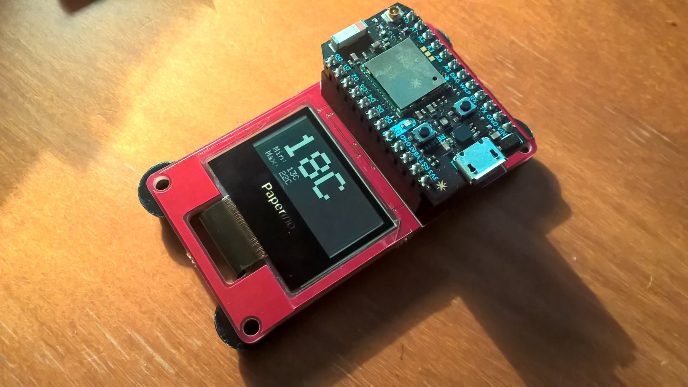

# Introduction

Welcome to the Paperino docs!

This is the place to get started with your new hardware! ;-) We have divided the documentation into the following sections:

* [Hookup guide](hookupEPD.md): Step-by-step instructions to get your Paperino setup and run within minutes.
* [Reference](refEPD.md): More infos around the ePaper and the accelerometer (data sheets…).
* [Examples](exampleHelloWorld.md): Ready to use examples for your own inspiration.

## So, what is Paperino?

Paperino is an easy to use micro EPD breakout-board for the Photon or other Arduino-compatible microcontrollers. The eInk-based ePaper display mimics the appearance of natural paper and is capable of holding text and images indefinitely, even without electricity. This makes Paperino perfect for your next battery-driven, connected project where the display content does not changes very often.

Paperino also integrates an easy to use accelerometer. It extends the EPD by tap-sensing functions and offers portrait/landscape detection. Furthermore you can wake-up your MCU after movement-based events from deep-sleeping, saving battery live during waiting phases.